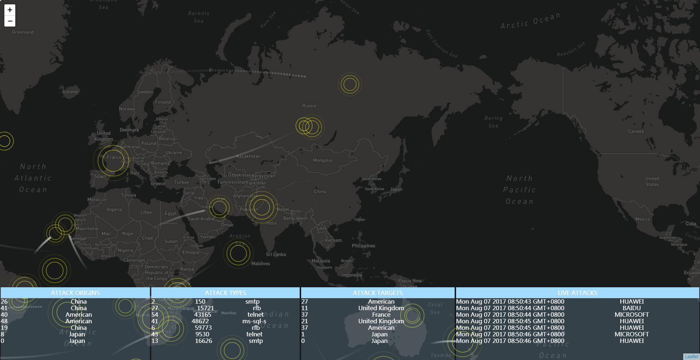

### 思路.
* 在[http://localhost:4000/wsSender/](http://localhost:4000/wsSender/)页面输入对应的数据, 数据会被 [http://localhost:4000/routes/wsSender/receiver](http://localhost:4000/routes/wsSender/receiver)接收, 然后通过socketIO转发给Attack.js内的socketIO接收. 然后在地图上绘制出相应的可视化效果.  
* 前后台的socketIO分别会存储在global和window的全局变量里面. 便于在各处接收和发送数据.  

